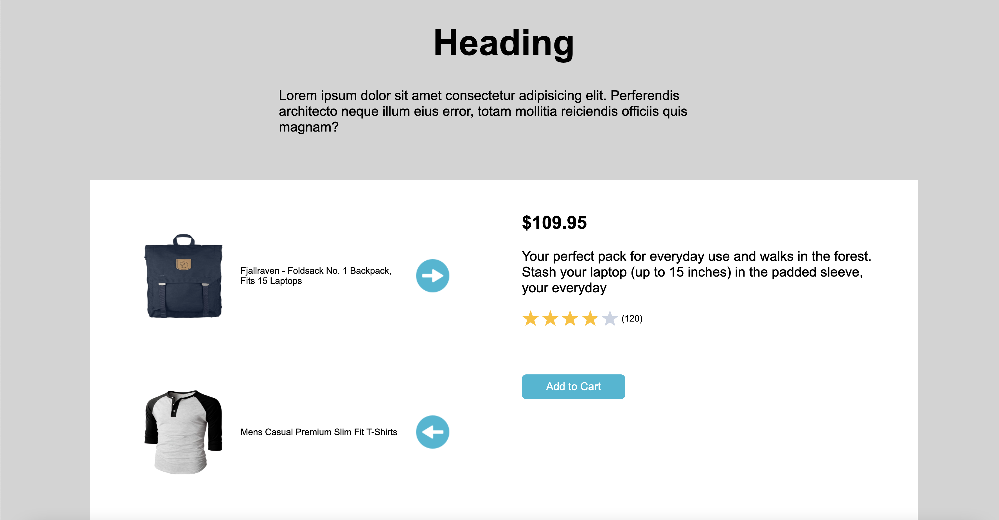

# Nuvolum Technical Assessment 

## Description 
This is a application created for Nuvolum's Technical Assessment for Front End Developer role. The purpose is to recreate a mockup in React without relying on external libraries and packages. This application retrieves data using an HTTP request from Nuvolum's API. Application must be deployed and fully responsive. 

## Table of Contents
* [Installation](#installation)
* [Usage](#usage)
* [Questions](#questions)

## Installation 
The user should clone the repository from GitHub. This application requires installation of React dependencies, axios, and react-star-ratings. 

## Usage 
This application allows users to view a catalog of products on the left panel and can view their details by clicking the arrow pointing to the right to display more details on the right panel. 
 
This application is deployed on Netifly and can be viewed [here](https://stupefied-mestorf-238369.netlify.app/)
 

## Questions
If you have any questions about this projects, please contact me directly at nicole.elisaw@gmail.com. You can view more of my projects at https://github.com/nicolewallace09.
